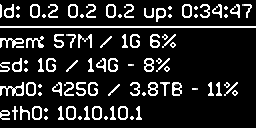

# Description
Application to display Helios4 System Status on I2C OLED display.




* Based on [luma.oled](https://github.com/rm-hull/luma.oled)
* Inspired from luma.oled [sys_info.py](https://github.com/rm-hull/luma.examples/blob/master/examples/sys_info.py) example

## INSTALLATION

```
git clone https://github.com/helios-4/sys-oled.git
cd sys-oled
sudo ./install.sh
```

## CONFIGURATION

### Configure OLED display model

1. Test which display model is the correct one by launching manually **sys-oled** and trying different display model as parameter until the System Status is showing correctly on the display.

Example :

```
sudo sys-oled --display ssd1306
sudo sys-oled --display sh1106

```

Supported values : ssd1306 (default), ssd1322, ssd1325, ssd1327, ssd1331, ssd1351, sh1106.

2. Once you know which display model is the correct one, edit */usr/local/etc/sys-oled.conf* and update the **display_model=** line.


### Configure storage info

By default **sys-oled** will display usage info of your micro SDcard which is most probably your Root File System. You can display storage usage info of one more storage device by editing */etc/sys-oled.conf*

```
sudo nano /etc/sys-oled.conf
```

You can edit the following lines to define for which storage devices you want to display usage info.

```
# Storage Device 1
# Device name
storage1_name = sd

# Device mount path
storage1_path = /

# Storage Device 2
storage2_name= md0
storage2_path= /mnt/md0

```

In the above example, we are displaying **sd** (SDcard) usage which is the rootfs mounted on *'/'*. We are also displaying **md0** (RAID array) that is mounted on *'/mnt/mnd0'*.

### Start the service

The install script will automatically setup **sys-oled** to start at every startup. Now you can either restart your Helios4 or you can launch directly the service with the following command:

```
systemctl start sys-oled.service
```

## Note

This sys-oled app was developed and tested only with the OLED model SH1106 which has a matrix panel of 132 x 64. If you use a different model that has a smaller resolution, you might need to tweak the coordinate values.
